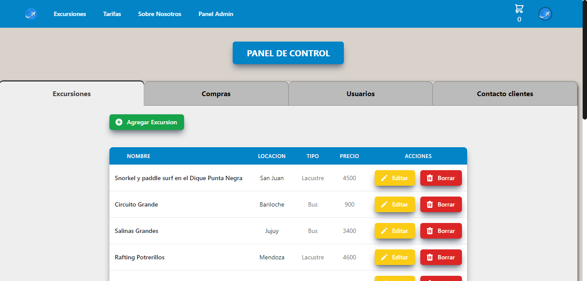
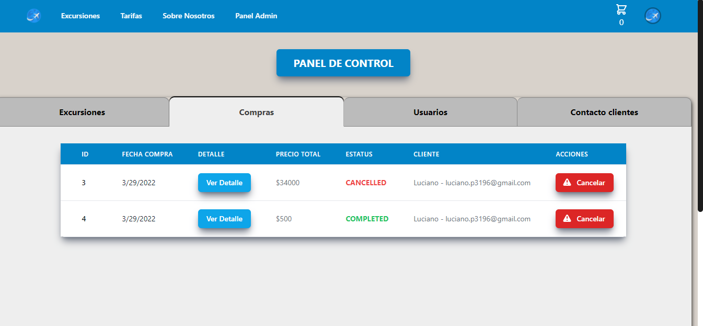
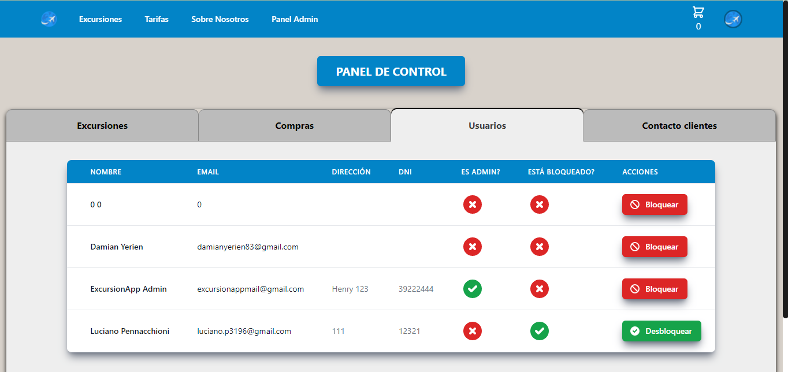
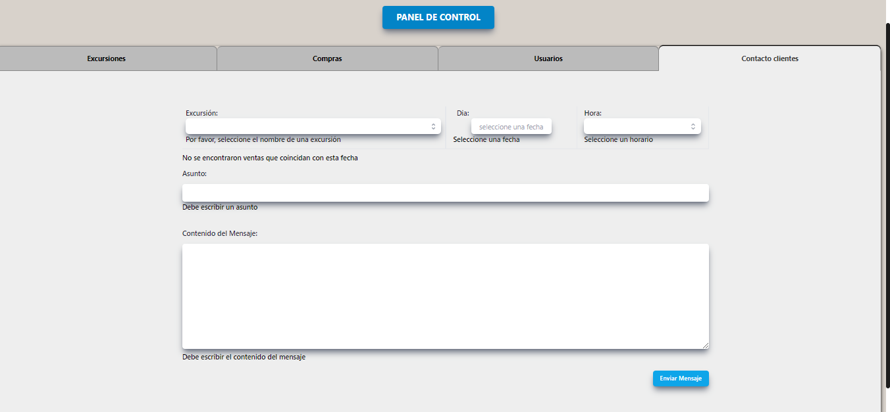

 
 
# E.Commerce de Excursiones

## Tecnologías utilizadas:

* __Javascript__
* __React__
* __Hooks__
* __Tailwind__
* __Node.Js__
* __Express__
* __PostgreSQL / Sequelize__
* __Auth0__
* __MercadoPago__
* __MapBox-GL-JS__

<p align="left"> <a href="https://www.w3schools.com/css/" target="_blank" rel="noreferrer">  </a> <a href="https://expressjs.com" target="_blank" rel="noreferrer">  </a> <a href="https://heroku.com" target="_blank" rel="noreferrer">  </a> <a href="https://developer.mozilla.org/en-US/docs/Web/JavaScript" target="_blank" rel="noreferrer">  </a> <a href="https://nodejs.org" target="_blank" rel="noreferrer">  </a> <a href="https://www.postgresql.org" target="_blank" rel="noreferrer">  </a> <a href="https://reactjs.org/" target="_blank" rel="noreferrer">  </a> <a href="https://tailwindcss.com/" target="_blank" rel="noreferrer">  </a> </p>


## Antes de empezar
Es necesario tener, al menos, la última versión estable de Node y NPM. Asegurese de tenerlas para instalar correctamente las dependencias necesarias para correr el proyecto.

Las versiones requeridas son:
- **Node**: 12.18.3 o mayor
- **NPM**: 6.14.16 o mayor

Para chequear que versiones tiene instaladas:
> node -v
>
> npm -v

## Instrucciones para correr el servidor de desarrollo

1. Clonar el repositorio
2. Crear una base de datos en postgres llamada pgexcursiones
3. Hay dos carpetas: api y client. En estas carpetas estará el código back-end y front-end respectivamente.
4. Crear un archivo en api llamado .env, que tendrá la siguiente estructura: 

```
DB_USER=postgresUser
DB_PASSWORD=postgresPassword
DB_HOST=localhost
```

Reemplazar postgresUser y postgresPassword por tus propias credenciales para conectarse a postgres.

5. Correr los siguientes comandos en las carpetas /api y /client:
```
npm install
npm start
```

## Descripción
La aplicación tiene como finalidad poder brindarle al usuario una visualización de diferentes
ofertas de excursiones disponibles a poder realizarse en distintos lugares de Argentina.
La plataforma no solo funcionará como un e-commerce de las excursiones, sino que también permitirá
que los usuarios puedan reservar excursiones, sacando turno a través de la misma plataforma.

**Datos bancarios para poder simular una compra:**
- nickname: TETE2951564
- password: qatest3960
- email: test_user_30825236@testuser.com
Tarjetas:
- Mastercard: 5031 7557 3453 0604
- Visa: 4509 9535 6623 3704
CVC: 123, Vto: 11/25


Funcionalidades:

**Como usuario, usted puede:**
- Ver las excursiones disponibles
- Registrarse y logearse en la aplicación
- Agregar excursiones al carrito y pagarlas mediante mercado pago
- Disponer de un registro de excursiones compradas y canceladas
- Contactar al administrador de la página mediante un formulario
- Filtrar excursiones con diferentes criterios
- Buscar excursiones por nombre o ubicación
- Ordenar excursiones por precio

**Como administrador, usted puede:**
- Banear usuarios, imposibilitandolos de poder comprar excursiones y dejar reviews. 
- Crear, editar y eliminar excursiones
- Disponer de un listado de compras completadas de usuarios, y poder cancelarlas en caso que hubiera alguna anomalía
- Enviar un email a todos los usuarios que compraron una determinada excursión.

Vista de administrador (panel de control):







## Deployment

La aplicación tiene el backend y bases de datos deployadas en [Heroku](https://heroku.com) y el frontend en [Vercel](https://vercel.com)

[Link](https://excursionapp.vercel.app/) to visit the app


